# Testing
## Manual testing
### Navigation Bar (not logged in)
The navigation bar allows the site user to navigate through the different pages of the site, either to the about page (home), collections page or sign in/sign up/log out page.
| feature | action | expected result | tested | passed | comments |
| --- | --- | --- | --- | --- | --- |
| Book Nest button in navigation| Click on "Book Nest" in navbar| Takes you to the about page| Yes | Yes | - |
| About button in navigation| Click on "About" in navbar| Takes you to the about page| Yes | Yes | - |
| Your collections button in navigation| Click on "Your collections" in navbar| Takes you to the sign in page if not logged in| Yes | Yes | - |
| Register button in navigation| Click on "Register" in navbar| Takes you to the register page (if logged out) | Yes | Yes | - |
| Login button in navigation| Click on "Login" in navbar| Takes you to the login page| Yes | Yes | - |

### Navigation Bar (logged in)
Amendmens to the navigation bar / site based on successful login.
| feature | action | expected result | tested | passed | comments |
| --- | --- | --- | --- | --- | --- |
| Logout button in navigation| Click on "Logout" in navbar| Takes you to the logout page| Yes | Yes | - |
| Login/Register buttons | Successful login | No longer shows "login" or "register" in navigation| Yes | Yes | - |
| Logged into account | Successful login | Page confirms "You are logged in as X" | Yes | Yes | - |
| Logged into account | Successful login | Success message appears confirming "succesfully signed in as X" | Yes | Yes | "You have signed out message also appearing" - error |
| Your Collections  button in navigation| Click on the "Collections" button| Takes you to the collections page if logged in| Yes | Yes | Did not highlight in navbar previously, amended during testing |

### About page
The about page provides context on the site purpose, and shows three example collections (from the user = example)
| feature | action | expected result | tested | passed | comments |
| --- | --- | --- | --- | --- | --- |
| View collection | Click on the "view collection" button for "Time to grow" collection | Takes you to the "Time to grow" example collection detail showing book cards| Yes | Yes | - |
| View collection | Click on the "view collection" button for "Motive and Mayhem" collection | Takes you to the "Motive and Mayhem" example collection detail showing book cards| Yes | Yes | - |
| View collection | Click on the "view collection" button for "Whirlwind summer" collection | Takes you to the "Whirlwind summer" example collection detail showing book cards| Yes | Yes | - |
| Sign up for an account button | Click on "Sign up for an account" | Takes you to the login page | Yes | Yes | - |
| Sign into your account button | Click on "Sign into your account" | Takes you to the login page | Yes | Yes | - |
| View collection button | Hover over view colletion button| "Go to collection" popup | Yes | Yes | - |

### Sign-up for an account
| feature | action | expected result | tested | passed | comments |
| --- | --- | --- | --- | --- | --- |
| Sign-up | Enter a common password | Red error message appears | Yes | Yes | - |
| Sign-up | Enter a short password | Red error message appears | Yes | Yes | - |
| Sign-up | Enter a numeric password only| Red error message appears | Yes | Yes | - |
| Sign-up | Enter an existing username| Red error message appears | Yes | Yes | - |

### Sign-into your account
| feature | action | expected result | tested | passed | comments |
| --- | --- | --- | --- | --- | --- |
| Sign-in | Enter incorrect username/password | Red error message appears | Yes | Yes | - |

### Collections 
| feature | action | expected result | tested | passed | comments |
| --- | --- | --- | --- | --- | --- |
| Filter | Select filter drop down| Drop down appears allowing you to filter | Yes | Yes | - |
| Filter | Select specific filter i.e. "Romance"| Filters collection to show "Romance" collections | Yes | Yes | - |
| Filter | Select specific filter i.e. "Mystery"| Filters collection to show "Mystery" collections | Yes | Yes | - |
| Filter | Select specific filter i.e. "Self-development"| Filters collection to show "Self-development" collections | Yes | Yes | - |
| Filter | Collection with same theme| Only shows theme once in filter | Yes | Yes | - |
| Edit collections | Hover over edit collections button| Changes colour and "edit collection" is shown | Yes | Yes | - |
| Edit collections | Edit collections button selected | Takes you to edit collection form | Yes | Yes | - |
| Collection cards | Click collection name | Takes you to the collection | Yes | Yes | Checked for each collection |

### Collections form
| feature | action | expected result | tested | passed | comments |
| --- | --- | --- | --- | --- | --- |
| Edit collections button  | Edit collection button selected | Redirected to edit collection form | Yes | Yes | - |
| Edit collections form redirect| None | Pre-populated form based on which collection was selected | Yes | Yes | - |
| Save | Save updates | Collection detail updated | Yes | Yes | - |
| Edit collections form | Save new collection detail information | Redirected to collection detail page | Yes | Yes | Redirect to home page initially|
| Save | Save updates | Success message appears for edit collection | Yes | Yes | Originally did not show, rendered in view and font-color changed to green. |

### Collection detail
| feature | action | expected result | tested | passed | comments |
| --- | --- | --- | --- | --- | --- |
| Edit book button | Edit book button selected | Redirected to edit book form| Yes | Yes | - |
| Edit book form | None | Pre-populated form based on which book was selected  | Yes | Yes | - |
| Save | Save updates | Book detail updated | Yes | Yes | - |
| Save | Save updates | Success message appears for edit book | Yes | Yes | Originally did not show, rendered in view and font-color changed to green. |
| Delete book button | Delete book button selected | Redirected to delete book modal| Yes | Yes | - |
| Delete book modal | Cancel delete request | Redirected to collection detail | Yes | Yes | - |
| Delete book modal | Yes, delete selected | Redirected to collection detail with book deleted | Yes | Yes | - |
| Yes, delete  | Yes, delete selected in modal for book | Success message appears confirming deletion of book| Yes | Yes | - |
| Add book button | Add book button to collection selected | Redirected to add book form| Yes | Yes | - |
| Add book to collection | Book added to collection |Success message shown confirming X book added| Yes | Yes | - |
| Add book  | Add book to collection | Redirected to collection detail with book added| Yes | Yes | - |
| Delete collection button | Delete collection button selected | Redirected to delete collection modal| Yes | Yes | - |
| Delete collection modal | Cancel delete request | Redirected to collection detail | Yes | Yes | - |
| Delete collection modal | Yes, delete selected | Redirected to collection page with collection deleted | Yes | Yes | - |
| Yes, delete  | Yes, delete selected in modal for collection| Success message appears confirming deletion of collection| Yes | Yes | - |
| Filter  | Filter by author |Show dropdown list of authors| Yes | Yes | Showed duplicate authors previously, fixed during testing |
| Book card  | None | Show book author| Yes | Yes | - |
| Book card  | None | Show book title | Yes | Yes | - |
| Book card  | None | Show book tags | Yes | Yes | Previously did not show tags for users i.e. showed "no tag" |
| Book card  | None | Show book status | Yes | Yes | - |

Book filter with duplicates:
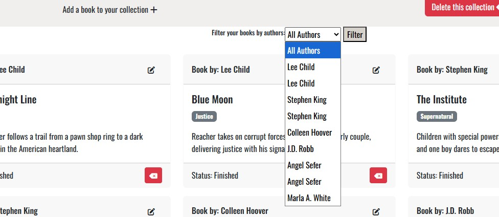

Amended book filter without duplicates:
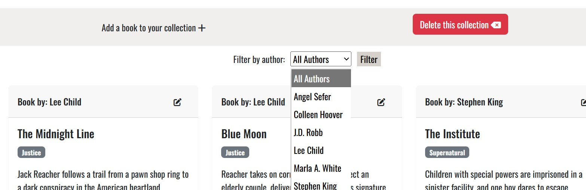

## HTML Validator Testing 
Code was validated using [W3C Validator](https://validator.w3.org/)

### About page / Home page validation
- No errors were returned when passing through the official W3C validator prior to submission.

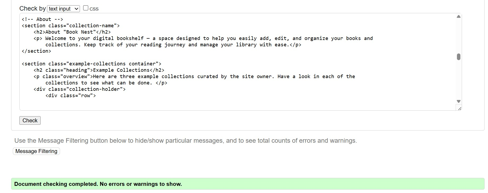

### Register page
- Four errors noted when passing through the official W3C validator. Relating to Django Allauth.

### Login page
- HTML: No errors were returned when passing through the official W3C validator prior to submission.

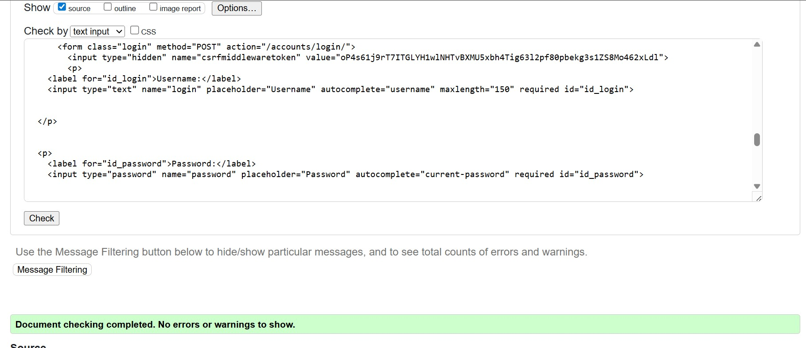

### Collections
- HTML: No errors were returned when passing through the official W3C validator prior to submission.

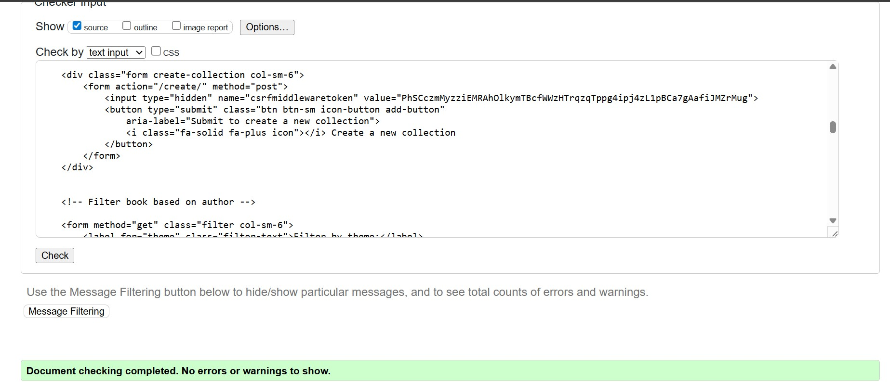

### Create collection
- HTML: No errors were returned when passing through the official W3C validator prior to submission.

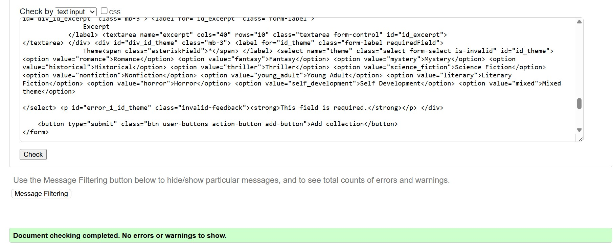

### Delete collection
- HTML: No errors were returned when passing through the official W3C validator prior to submission.

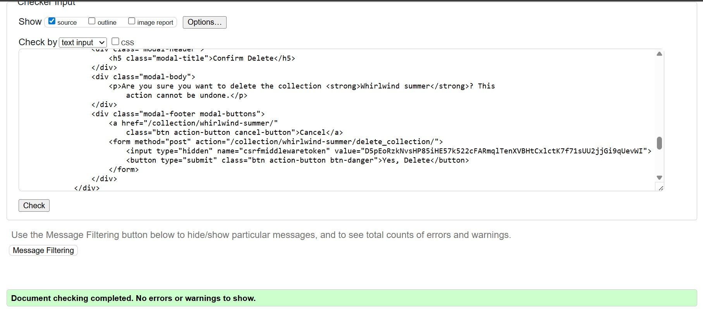

### Collection detail
- HTML: No errors were returned when passing through the official W3C validator prior to submission.

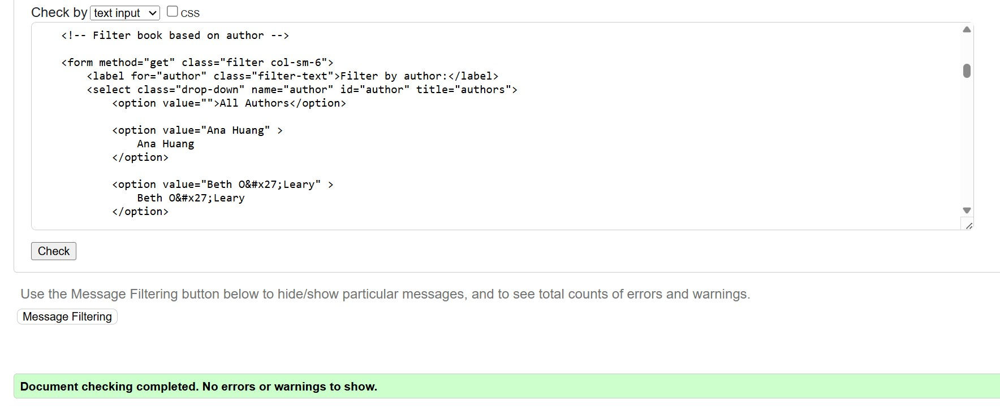

### Add book to collection
- HTML: No errors were returned when passing through the official W3C validator prior to submission.

Add book validation:
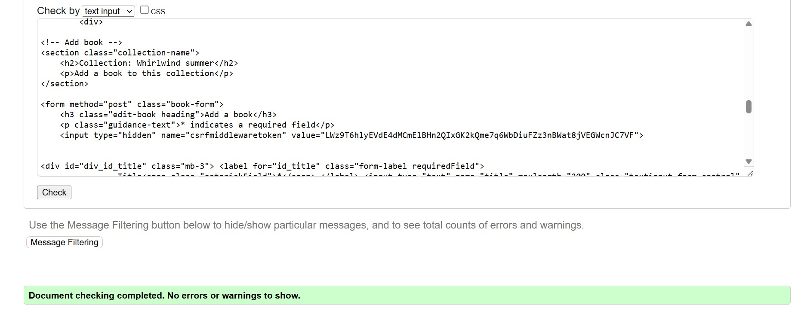

### Edit book in collection
- HTML: No errors were returned when passing through the official W3C validator prior to submission.
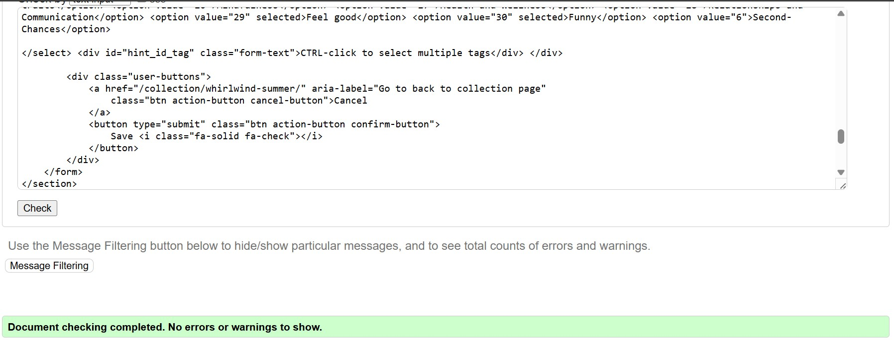

### Delete book in collection
- HTML: No errors were returned when passing through the official W3C validator prior to submission.
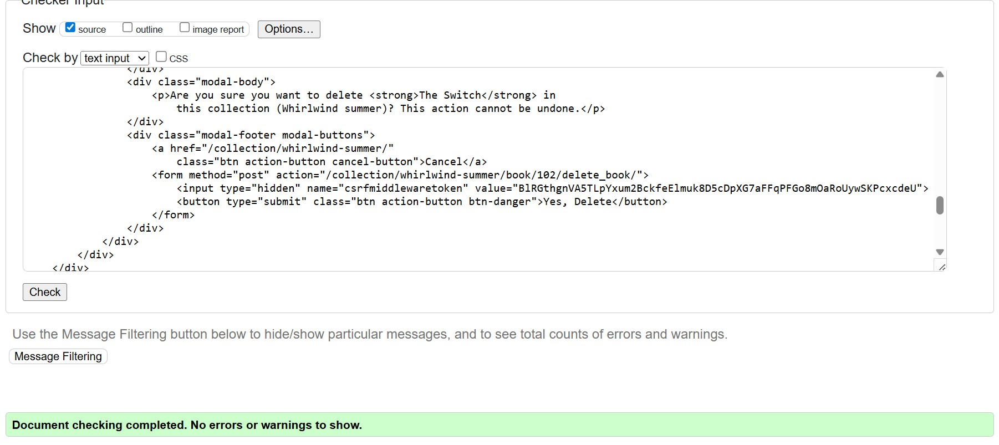

## CSS Validator Testing
Code was validated using the [W3C CSS Validator](https://jigsaw.w3.org/css-validator/validator)

Two warnings with CSS validation by direct input:
- Imported style sheets are not checked in direct input and file upload modes
- Due to their dynamic nature, CSS variables are currently not statically checked

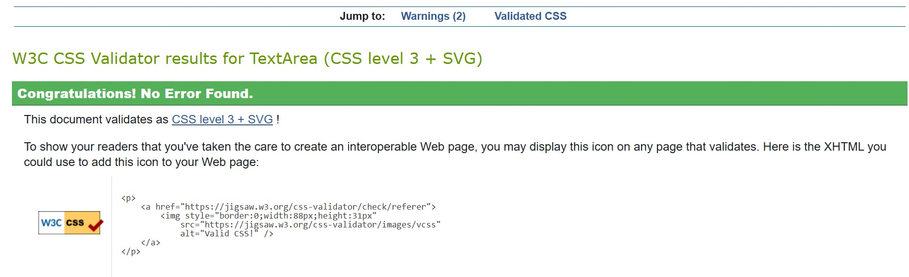

## Python Validator Testing
Code was validated using [CI Python Linter](https://pep8ci.herokuapp.com/).
### Library App
#### admin.py validation
No errors were returned when passing through CI Python Linter.
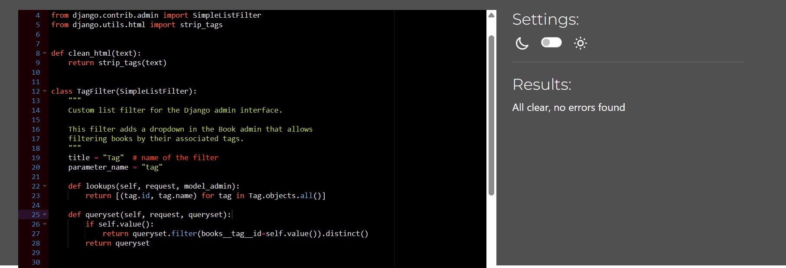

####  apps.py validation
No errors were returned when passing through CI Python Linter.
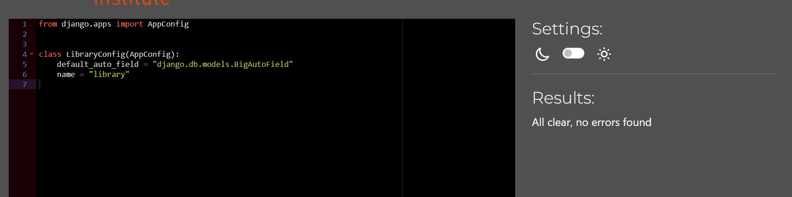

####  forms.py validation
No errors were returned when passing through CI Python Linter.
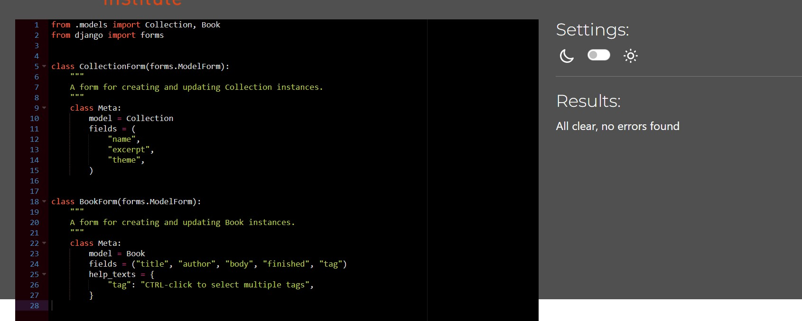

#### models.py validation
No errors were returned when passing through CI Python Linter.
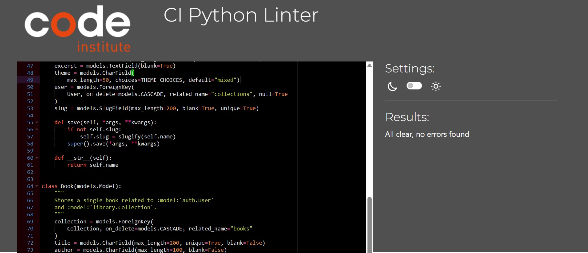

#### views.py validation
No errors were returned when passing through CI Python Linter.
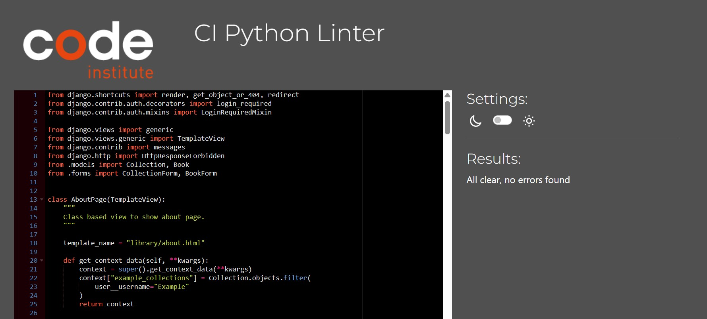

#### urls.py validation
No errors were returned when passing through CI Python Linter.
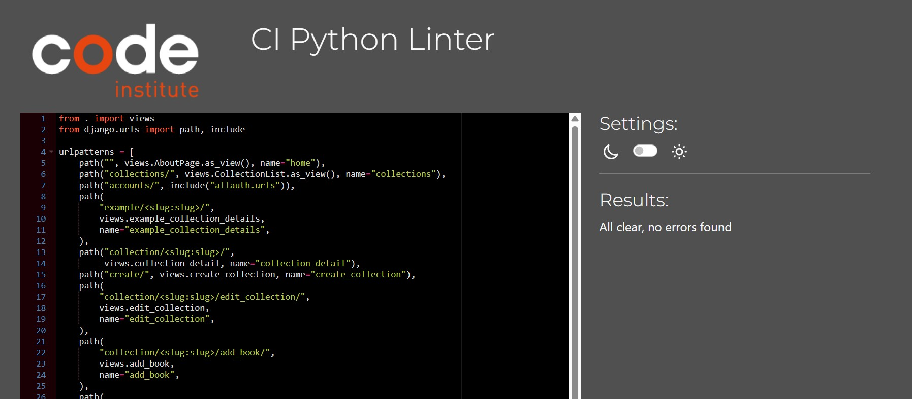

